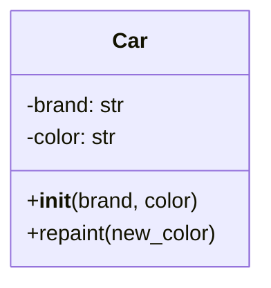

# Python Klasser: Bil-eksempel

---

## Hvad er en klasse?

En **klasse** er en skabelon til at lave objekter med egenskaber og metoder.

```python
class Car:
    def __init__(self, brand, color):
        self.brand = brand
        self.color = color
    
    def repaint(self, new_color):
        self.color = new_color
```

## Klassediagram



## Oprette og bruge objekter

```python
# Opret en instans
my_car = Car("Toyota", "blue")
print(my_car.brand)    # Toyota
print(my_car.color)    # blue

# Brug metoden
my_car.repaint("red")
print(my_car.color)    # red
```
